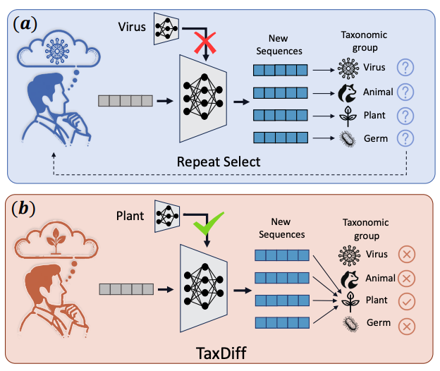

# Zongying Lin — Academic Homepage

> Personal academic homepage of **Zongying Lin (林宗莹)**, M.S. student at Peking University.  
> Style inspired by [shaodong233.github.io](https://shaodong233.github.io/) (Minimal Mistakes theme).  
> Live at: **<https://linzongying.github.io>** <!-- change to your actual URL -->



## ✨ Features

- 🎨 **Minimal-Mistakes-inspired typography** — PT Serif + PT Sans Narrow
- 🌐 **Bilingual (English / 中文)** — one-click toggle, persisted in localStorage
- 📊 **Live Google Scholar stats** — citations, h-index, i10-index auto-refreshed **daily** via GitHub Actions
- 💬 **WeChat modal** — click-to-reveal ID with one-tap copy
- 📱 **Responsive** — mobile / tablet / desktop
- ♿ **Accessible** — semantic HTML, focus-visible, skip-link, aria labels
- 🚀 **Static site** — no build step; works on plain GitHub Pages

## 🔧 How it works

### Live Scholar Stats

1. [`update-scholar.py`](./update-scholar.py) — Python script that fetches your Scholar profile page and parses the stats table into `scholar.json`.
2. [`.github/workflows/update-scholar.yml`](./.github/workflows/update-scholar.yml) — GitHub Actions workflow that runs the script **daily at 00:00 UTC (08:00 Beijing)** and auto-commits any changes.
3. **Front-end** — `index.html` fetches `scholar.json` on page load and animates the numbers into the stats cells. Silently falls back to cached values if the file is unreachable.

### Manual refresh

```bash
python3 update-scholar.py
```

Or trigger from GitHub: **Actions → Update Scholar Stats → Run workflow**.

### Required GitHub settings

For the Action to push back to the repo, go to:
**Settings → Actions → General → Workflow permissions → Read and write permissions**

## 🗂️ File Structure

```
.
├── index.html                 # The homepage
├── avatar.jpg                 # Circular bio photo (400×400)
├── portrait.jpg               # Article portrait (600×800)
├── scholar.json               # Auto-updated Scholar metrics
├── update-scholar.py          # Scholar fetcher script
├── paper_thumbs/              # Publication thumbnails
│   ├── taxdiff.png
│   ├── prollama.png
│   ├── multi_transsp.png
│   ├── chemling.png
│   ├── mg_score.png
│   └── casa.png
├── 林宗莹-北京大学-计算机应用技术-硕士.pdf   # CV (optional)
└── .github/workflows/
    └── update-scholar.yml     # Daily cron
```

## 🚀 Deploy to GitHub Pages

### Option A — User site (recommended)

1. Create a new public repo on GitHub named exactly **`<your-username>.github.io`**.
2. Push this directory:
   ```bash
   git remote add origin https://github.com/<your-username>/<your-username>.github.io.git
   git push -u origin main
   ```
3. Settings → Pages → Source = **Deploy from a branch** → Branch = **main** / **root** → Save.
4. Visit `https://<your-username>.github.io` (may take 1–2 minutes on first deploy).

### Option B — Project site

1. Create any public repo (e.g. `academic-homepage`).
2. Push and enable Pages as above.
3. Visit `https://<your-username>.github.io/academic-homepage/`.

## 🎨 Customize for Your Own Use

Fork this repo and edit:

| What | Where |
|---|---|
| Name / bio / contact | `index.html` — Hero + About Me sections |
| Photos | Replace `avatar.jpg` and `portrait.jpg` |
| Publications | `index.html` — `<article class="paper-item">` blocks + `paper_thumbs/*.png` |
| Education / Experience / Awards | `index.html` — corresponding sections |
| Google Scholar user ID | `update-scholar.py` — `USER = 'your-scholar-id'` |

## 📜 License

Content (text, photos, publications) © Zongying Lin.  
Template structure inspired by [Minimal Mistakes](https://mademistakes.com/) — feel free to reuse the layout/CSS for your own academic homepage.
